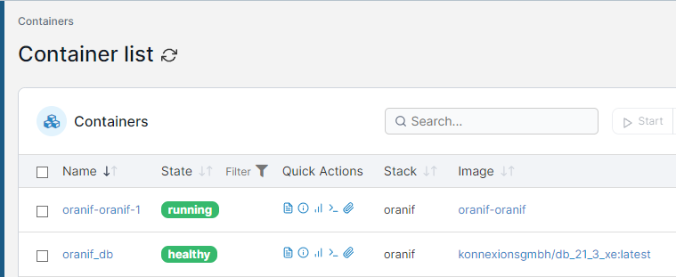
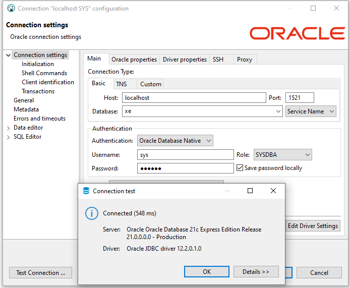
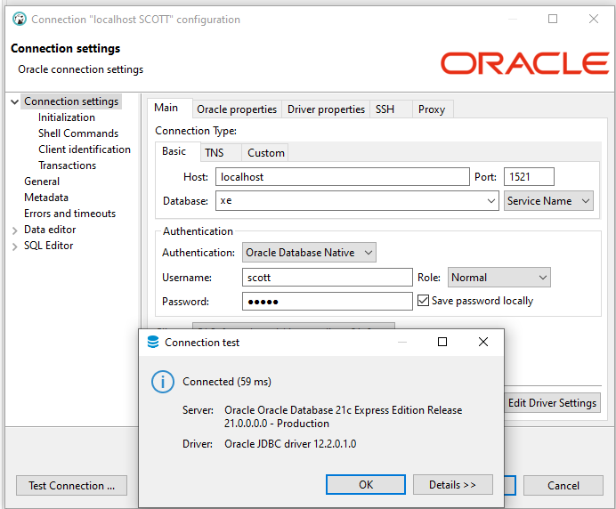

# oranif: Docker Compose Usage

## 1. Starting the services: `docker-compose up`

**Note**: The required Docker images were not yet available.

**Log of the process**:

    ...\oranif>docker-compose up
    [+] Running 6/6
    - db Pulled                                                                                                                                                                         45.8s
      - a2a00260331c Already exists                                                                                                                                                      0.0s
      - 1d8a6a2ccf41 Already exists                                                                                                                                                      0.0s
      - 04cd629c42ca Already exists                                                                                                                                                      0.0s
      - 4f4fb700ef54 Already exists                                                                                                                                                      0.0s
      - 163432d25edd Pull complete                                                                                                                                                      43.9s
    [+] Building 6.2s (13/14)
    => [internal] load build definition from Dockerfile                                                                                                                                  0.0s
    => => transferring dockerfile: 32B                                                                                                                                                   0.0s
    => [internal] load .dockerignore                                                                                                                                                     0.0s
    => => transferring context: 2B                                                                                                                                                       0.0s
    => [internal] load metadata for docker.io/library/erlang:24.3.4-slim                                                                                                                 6.2s
    => [auth] library/erlang:pull token for registry-1.docker.io                                                                                                                         0.0s
    => [internal] load build context                                                                                                                                                     0.0s
    => => transferring context: 6.49kB                                                                                                                                                   0.0s
    => [stage-1 1/4] FROM docker.io/library/erlang:24.3.4-slim@sha256:4b674304c9ccf7affa1a52e7564f2f2aeab1de330438c95b8c0f9566e9afb2c0                                                   0.0s
    => CACHED [base 2/5] RUN apt-get -y update     && apt-get -y install         build-essential         alien         git         lcov         libaio-dev         libaio1         wget  0.0s
    => CACHED [base 3/5] RUN wget --quiet --no-check-certificate -nv https://download.oracle.com/otn_software/linux/instantclient/217000/oracle-instantclient-basic-21.7.0.0.0-1.x86_64  0.0s
    => CACHED [base 4/5] RUN wget --quiet --no-check-certificate -nv https://download.oracle.com/otn_software/linux/instantclient/217000/oracle-instantclient-sqlplus-21.7.0.0.0-1.x86_  0.0s
    => CACHED [base 5/5] RUN alien -i --scripts *.rpm     && rm -rf *.x86_64.rpm     && sqlplus -V     && apt-get -y autoclean     && apt-get -y autoremove     && rm -rf /tmp/*         0.0s
    => CACHED [stage-1 2/4] COPY --from=base / /                                                                                                                                         0.0s
    => [stage-1 3/4] COPY . /                                                                                                                                                            0.7s
    => [stage-1 4/4] RUN rebar3 compile                                                                                                                                                  4.2s
    => exporting to image                                                                                                                                                                0.1s
    => => exporting layers                                                                                                                                                               0.1s
    => => writing image sha256:89125772bca36f7e0e931e162ceeb022f889e75678f21ab1c9a64ea3868bd83a                                                                                          0.0s
    => => naming to docker.io/library/oranif-oranif                                                                                                                                      0.0s
    [+] Running 2/2
    - Container oranif_db        Created                                                                                                                                                 0.0s
    - Container oranif-oranif-1  Created                                                                                                                                                 0.0s
    Attaching to oranif-oranif-1, oranif_db
    oranif_db        | Starting Oracle Net Listener.
    oranif_db        | Oracle Net Listener started.
    oranif_db        | Starting Oracle Database instance XE.
    oranif_db        | Oracle Database instance XE started.
    oranif_db        |
    oranif_db        | The Oracle base remains unchanged with value /opt/oracle
    oranif_db        | #########################
    oranif_db        | DATABASE IS READY TO USE!
    oranif_db        | #########################
    oranif_db        | The following output is now a tail of the alert.log:
    oranif_db        | 2022-10-07T19:36:54.686012+00:00
    oranif_db        | ===========================================================
    oranif_db        | Dumping current patch information
    oranif_db        | ===========================================================
    oranif_db        | No patches have been applied
    oranif_db        | ===========================================================
    oranif_db        | Starting background process CJQ0
    oranif_db        | 2022-10-07T19:36:54.708799+00:00
    oranif_db        | CJQ0 started with pid=58, OS id=548
    oranif_db        | Completed: ALTER DATABASE OPEN
    oranif_db        | 2022-10-07T19:36:55.538519+00:00
    oranif_db        | Thread 1 advanced to log sequence 3 (LGWR switch),  current SCN: 2624510
    oranif_db        |   Current log# 3 seq# 3 mem# 0: /opt/oracle/oradata/XE/redo03.log
    oranif-oranif-1  |
    oranif-oranif-1  | SQL*Plus: Release 21.0.0.0.0 - Production on Fri Oct 7 19:37:49 2022
    oranif-oranif-1  | Version 21.7.0.0.0
    oranif-oranif-1  |
    oranif-oranif-1  | Copyright (c) 1982, 2022, Oracle.  All rights reserved.
    oranif-oranif-1  |
    oranif-oranif-1  |
    oranif-oranif-1  | Connected to:
    oranif-oranif-1  | Oracle Database 21c Express Edition Release 21.0.0.0.0 - Production
    oranif-oranif-1  | Version 21.3.0.0.0
    oranif-oranif-1  |
    oranif-oranif-1  | ===============================================================================
    oranif-oranif-1  | Current user is now: SYS
    oranif-oranif-1  | ===============================================================================
    oranif-oranif-1  | Start run_db_setup.sql
    oranif-oranif-1  | ===============================================================================
    oranif-oranif-1  | Adding database schema SCOTT ...
    oranif-oranif-1  | <------------------------------------------------------------------------------>
    oranif-oranif-1  | Executed: ALTER SESSION SET "_ORACLE_SCRIPT"=TRUE
    oranif-oranif-1  | Executed: CREATE USER SCOTT IDENTIFIED BY regit
    oranif-oranif-1  | ===============================================================================
    oranif-oranif-1  | Granting privileges to schema SCOTT ...
    oranif-oranif-1  | <------------------------------------------------------------------------------>
    oranif-oranif-1  | Executed: GRANT ALTER SYSTEM TO SCOTT
    oranif-oranif-1  | Executed: GRANT CREATE PROCEDURE TO SCOTT
    oranif-oranif-1  | Executed: GRANT CREATE SESSION TO SCOTT
    oranif-oranif-1  | Executed: GRANT CREATE TABLE TO SCOTT
    oranif-oranif-1  | Executed: GRANT UNLIMITED TABLESPACE TO SCOTT
    oranif-oranif-1  | Executed: GRANT CREATE TRIGGER TO SCOTT
    oranif-oranif-1  | -------------------------------------------------------------------------------
    oranif-oranif-1  | End   run_db_setup.sql
    oranif-oranif-1  | ===============================================================================
    oranif-oranif-1  | Disconnected from Oracle Database 21c Express Edition Release 21.0.0.0.0 - Production
    oranif-oranif-1  | Version 21.3.0.0.0
    oranif_db        | 2022-10-07T19:56:58.973223+00:00
    oranif_db        | Resize operation completed for file# 3, fname /opt/oracle/oradata/XE/sysaux01.dbf, old size 573440K, new size 593920K
    oranif_db        | 2022-10-07T19:56:58.979235+00:00
    oranif_db        | XEPDB1(3):Resize operation completed for file# 10, fname /opt/oracle/oradata/XE/XEPDB1/sysaux01.dbf, old size 337920K, new size 358400K

## 2. The Docker containers in the Portainer view

## 3. The DBeaver connection for the SYS (`sys/oracle`) schema 

**Database access via SQL*Plus:** 

    ...>sqlplus sys/oracle@localhost:1521/xe as sysdba
    SQL*Plus: Release 21.0.0.0.0 - Production on Fri Oct 7 22:32:29 2022
    Version 21.6.0.0.0
    Copyright (c) 1982, 2021, Oracle.  All rights reserved.
    Connected to:
    Oracle Database 21c Express Edition Release 21.0.0.0.0 - Production
    Version 21.3.0.0.0
    SQL> exit
    Disconnected from Oracle Database 21c Express Edition Release 21.0.0.0.0 - Production
    Version 21.3.0.0.0

## 4. The DBeaver connection for the SCOTT (`scott/regit`) schema 

**Database access via SQL*Plus:**

    ...>sqlplus scott/regit@localhost:1521/xe
    SQL*Plus: Release 21.0.0.0.0 - Production on Fri Oct 7 22:34:45 2022
    Version 21.6.0.0.0
    Copyright (c) 1982, 2021, Oracle.  All rights reserved.
    Last Successful login time: Fri Oct 07 2022 22:29:24 +02:00
    Connected to:
    Oracle Database 21c Express Edition Release 21.0.0.0.0 - Production
    Version 21.3.0.0.0
    SQL> exit
    Disconnected from Oracle Database 21c Express Edition Release 21.0.0.0.0 - Production
    Version 21.3.0.0.0

## 5. Entering the oranif container:  `docker-compose exec oranif bash`

**Log of the process**:

    ...>docker-compose exec oranif bash
    root@c7b583bed449:/#

**Schema SYS: Database access via SQL*Plus:**

    ...# sqlplus sys/oracle@oranif_db:1521/xe as sysdba                                                                                                       
    SQL*Plus: Release 21.0.0.0.0 - Production on Fri Oct 7 20:37:44 2022
    Version 21.7.0.0.0
    Copyright (c) 1982, 2022, Oracle.  All rights reserved.
    Connected to:
    Oracle Database 21c Express Edition Release 21.0.0.0.0 - Production
    Version 21.3.0.0.0
    SQL> exit
    Disconnected from Oracle Database 21c Express Edition Release 21.0.0.0.0 - Production
    Version 21.3.0.0.0

**Schema SCOTT: Database access via SQL*Plus:**

    ...# sqlplus scott/regit@oranif_db:1521/xe
    SQL*Plus: Release 21.0.0.0.0 - Production on Fri Oct 7 20:40:42 2022
    Version 21.7.0.0.0
    Copyright (c) 1982, 2022, Oracle.  All rights reserved.
    Last Successful login time: Fri Oct 07 2022 20:34:45 +00:00
    Connected to:
    Oracle Database 21c Express Edition Release 21.0.0.0.0 - Production
    Version 21.3.0.0.0
    SQL> exit
    Disconnected from Oracle Database 21c Express Edition Release 21.0.0.0.0 - Production
    Version 21.3.0.0.0

